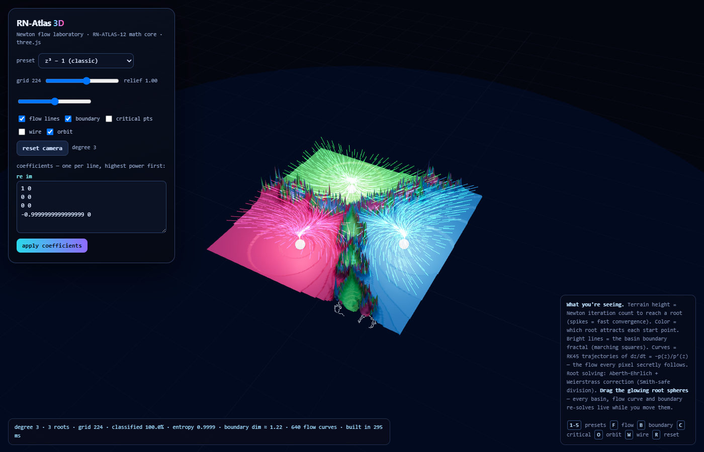
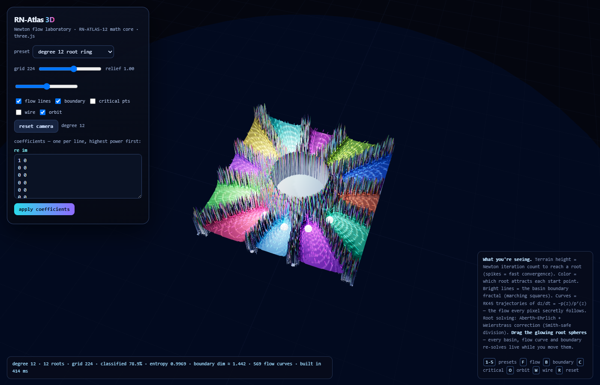
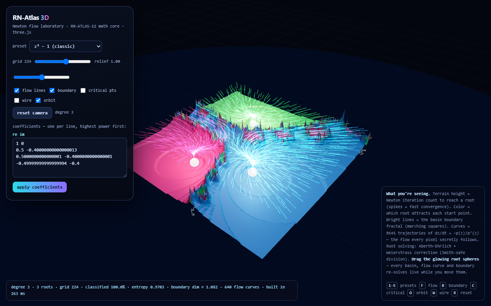

# RN-Atlas 3D — the three.js companion

An interactive 3D rendering of the Riemann–Newton Atlas math, built on the
**exact verified numerical core** from the benchmark submission (Smith-safe
division, fused Horner, Aberth–Ehrlich + Weierstrass correction, Dormand–Prince
RK45). The frozen `index.html` at the repository root is untouched; this is a
separate artifact that reuses its math byte-for-byte.



## Run it

Open [`atlas3d.html`](atlas3d.html) in any modern browser. The file is fully
self-contained — math core and renderer (three.js 0.180) are inlined — no
network, no server, no dependencies.

## What you're seeing

- **Terrain height** = Newton iteration count to reach a root (`(it/40)^0.55`,
  adjustable via the relief slider). Spikes are fast convergence; the low pale
  ridge is the chaotic basin boundary.
- **Color** = which root attracts each point (golden-angle hue per root,
  iteration-shaded).
- **Bright lines** = the basin-boundary fractal, extracted with the same
  marching-squares formulation as the 2D atlas.
- **Glowing curves** = RK45 trajectories of dz/dt = −p(z)/p′(z) — the
  continuous Newton flow every pixel secretly follows.
- **White spheres** = the roots (with real point lights). Toggleable gold cones
  mark the critical points of p′, where the flow has no direction.

## Interact

- **Drag the glowing root spheres** — every basin, flow curve and boundary
  re-solves live while you move them (lighter grid mid-drag for
  responsiveness, full-resolution rebuild on release).
- Orbit/zoom/pan (damped OrbitControls, gentle auto-orbit), presets `1–5`,
  coefficient editor (`re im` per line, highest power first, degree 3–12,
  re-solved via Aberth on apply), grid resolution 96–320, relief slider.
- Keyboard: `1-5` presets · `F` flow · `B` boundary · `C` critical points ·
  `W` wireframe · `O` auto-orbit · `R` reset camera.





## Verified result

Headless Chrome + SwiftShader (software WebGL, so verification never touches a
GPU), 2026-08-05. Receipts in [`../proofs/`](../proofs/):

- **Boot**: zero console/page errors, zero failed requests on the
  self-contained file.
- **z³ − 1**: 50,624/50,625 grid points classified (99.998%), entropy 0.9999,
  boundary dimension ≈ **1.22** (theoretical ≈ 1.1–1.4, matching NOTES.md).
- **Degree-12 ring preset**: degree 12 confirmed, dim ≈ 1.44, 569 flow curves.
- **Coefficient editor path** (z³ − 2z + 1): degree 3, 100% classified.
- **Root drag** ((1,0) → (0.2,0.9)): root lands on target, basins fully
  re-solve (dim 1.22 → 1.002, boundary geometry changes), coefficient editor
  stays in sync.
- **Pixel probe**: 79.9% of framebuffer lit, 79.2% chromatic (no black-screen
  failure mode).

## Re-run verification

From this directory:

```powershell
npm install
node verify-companion.js
```

Targets the standard Windows installation path for Google Chrome.

## Known limitations

1. Verified via software rendering only; visual quality on a real GPU will be
   better.
2. Flow curves are 1-px additive line primitives, not true tubes.
3. Terrain is a height field (no overhangs); boundary cells are a flat ridge.
4. Coefficient editor textarea clips tall polynomials (scroll) — cosmetic; the
   status line always shows the true degree.
