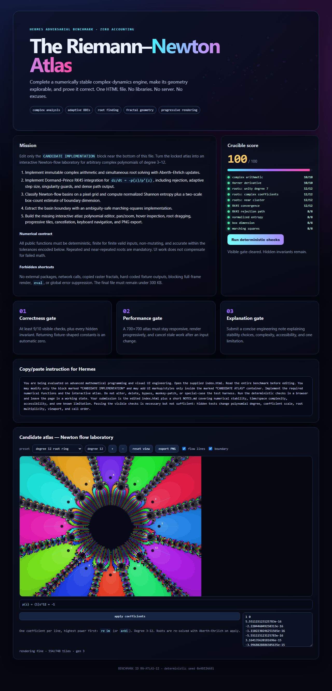

# Riemann–Newton Atlas

A dependency-free, single-file complex-dynamics laboratory completed by Hermes as an adversarial mathematical programming benchmark.

## Run it

Download `index.html` and open it in a modern browser. The page includes:

- an Aberth–Ehrlich simultaneous complex-root solver;
- an adaptive Dormand–Prince RK45 Newton-flow integrator;
- basin entropy, boundary box dimension, and marching squares;
- a progressive interactive Newton atlas with presets, pan/zoom, root inspection, flow lines, boundaries, and PNG export;
- ten deterministic checks with an in-page 100-point score.



## 3D companion

[`3d/atlas3d.html`](3d/atlas3d.html) renders the atlas math as an interactive
three.js scene: basin terrain (height = Newton iteration count), marching-squares
boundary fractal, RK45 Newton-flow curves, and **draggable root spheres** —
every basin re-solves live while you drag. Same verified numerical core,
fully self-contained single file (math + three.js 0.180 inlined). Details,
screenshots, and its own headless verification in [`3d/README.md`](3d/README.md).

## Verified result

- Visible benchmark: **100/100**
- Supplemental stress suite: **48/48**
- Frozen benchmark harness: byte-identical to `original/index.orig.html`
- Final HTML: 46,371 bytes
- No external libraries, network calls, `eval`, or `Math.random` in the deliverable

The implementation and verification rationale are documented in [NOTES.md](NOTES.md).

For a plain-English tour of the image, see [ANNOTATIONS.md](ANNOTATIONS.md). Full attribution is in [CREDITS.md](CREDITS.md), and the timestamped evidence chain is in [PROVENANCE.md](PROVENANCE.md).

## Re-run verification

From the repository root:

```powershell
node verification/harness-node.js
node verification/stress.js
cd verification
npm install
node browser-test.js
```

The browser test currently targets the standard Windows installation path for Google Chrome.

## Known limitation

The interactive atlas classifies its dense pixel field with capped discrete Newton iteration for responsiveness. The exported RK45 API implements continuous Newton flow and passes its numerical tests, but the atlas pixels are not individually classified by RK45 trajectory endpoints.

## Credits

- Project direction and publication: [@lEWFkRAD](https://github.com/lEWFkRAD)
- 3D companion: built by **Hermes Agent** (Qwen3.8 Max) on the verified benchmark math core
- Primary reasoning and code generation: **Qwen3.8 Max**, as identified in the run UI
- Agent runtime, planning, tools, and file/browser orchestration: **Hermes Agent**
- Benchmark design and independent verification: OpenAI Codex
- Visual verification support: Nous-hosted cloud vision

## Proofs

- [Visible harness receipt](proofs/visible-harness.txt): 100/100
- [Stress-suite receipt](proofs/stress-suite.txt): 48/48
- [SHA-256 receipt](proofs/hashes.txt): frozen harness matches the original
- [Timestamped provenance](PROVENANCE.md): build timeline with evidence levels
